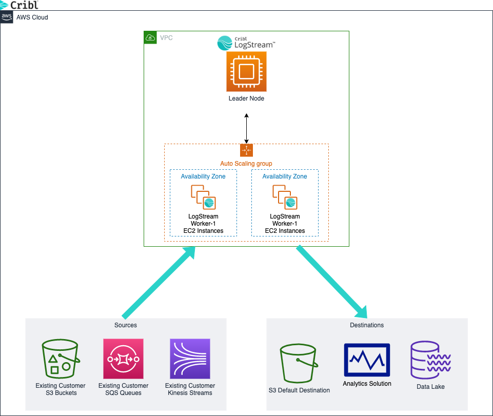

# Cribl LogStream on Amazon
> This Quick Start guide was created by [Cribl](https://cribl.io) to help automate the deployment of Cribl LogStream in your AWS environment. These  automated reference deployments use AWS CloudFormation templates to deploy EC2 instances, IAM policies and S3 buckets, following AWS best practices. 

## Overview 
Cribl has put together a simple method to launch a CloudFormation template that will automatically create the IAM EC2 role and the proper IAM policy to use with your deployment. We will be breaking down the permissions used, AWS resources deployed and their associated costs. This process will take around 5 minutes and you will have a running Cribl LogStream deployment. 

## Cribl Cloud
If you want to just deploy a Cribl LogStream Standard instance running on AWS, you can also head over to [Cribl.Cloud](https://cribl.cloud) and sign up for your own free tenant. 

## Architecture 
Deploying this Quick Start with default parameters will build a single EC2 instance Master Instance with however many worker nodes you specify in the CloudFormation Template. The instances will be launched within the VPC and (AZ's) you specify. This deployment will also create an S3 bucket that can be used as a source or destination. The EC2 Role and the associated policy will also be created as a part of this CloudFormation template and assigned to the Worker Nodes. The Master Node does not have an EC2 policy associated with it. 



_Figure 1: Cribl LogStream Distributed architecture deployment in AWS_

As shown in Figure 1, the Quick Start CloudFormation template sets up the following:

* In AWS: 
   * EC2 Instances
   * Security Groups
   * S3 Bucket
   * IAM Role and Policy
> IAM Policy Best practices 
>
> Per the [Security best practices in IAM](https://docs.aws.amazon.com/IAM/latest/UserGuide/best-practices.html) the policy created by the CloudFormation template creates an EC2 role with the following IAM Policy:

```yaml 
iamDefaultWorkerRole:
    Type: AWS::IAM::Role
    Properties:
      RoleName: !Sub '${AWS::StackName}-logstream-worker-role'
      Description: Cribl LogStream default IAM role
      AssumeRolePolicyDocument:
        Version: '2012-10-17'
        Statement:
          - Effect: Allow
            Principal:
              Service:
                - ec2.amazonaws.com
            Action:
              - sts:AssumeRole
      ManagedPolicyArns:
        - arn:aws:iam::aws:policy/AmazonSSMManagedInstanceCore
        - arn:aws:iam::aws:policy/CloudWatchAgentServerPolicy
      Policies:
        - PolicyName: S3Destinations
          PolicyDocument:
            Version: '2012-10-17'
            Statement:
              - Effect: Allow
                Action:
                  - s3:PutObject
                  - s3:GetObject
                  - s3:ListBucket
                  - s3:GetBucketLocation
                Resource:
                  - !Sub '${s3DefaultDestinationBucket.Arn}'
                  - !Sub '${s3DefaultDestinationBucket.Arn}/*'
        - PolicyName: S3Sources
          PolicyDocument:
            Version: '2012-10-17'
            Statement:
              - Effect: Allow
                Action:
                  - s3:GetObject
                  - s3:GetBucketLocation
                Resource: '*'
        - PolicyName: KinesisSources
          PolicyDocument:
            Version: '2012-10-17'
            Statement:
              - Effect: Allow
                Action:
                  - kinesis:Get*
                  - kinesis:List*
                  - kinesis:Describe*
                Resource: '*'
        - PolicyName: SQSSources
          PolicyDocument:
            Version: '2012-10-17'
            Statement:
              - Effect: Allow
                Action: 
                  - sqs:ReceiveMessage
                  - sqs:DeleteMessage
                  - sqs:GetQueueAttributes
                  - sqs:GetQueueUrl
                Resource: '*'
      Tags:
        - Key: Name
          Value: Cribl LogStream default IAM role
  iamDefaultWorkerInstanceProfile:
    Type: AWS::IAM::InstanceProfile
    Properties:
      Path: /
      Roles:
        - !Ref 'iamDefaultWorkerRole'
```

>This IAM Role ties the actions of listing, reading and writing to the specific S3 bucket created during this process. Then this policy is attached to the EC2 Worker instance rather than using Access / Secret keys for authentication. 

## Cost and licenses

You are responsible for the cost of the AWS services used while running this Quick Start reference deployment. There are no additional costs for using the Quick Start. The Cribl LogStream license included in your deployment will default to the LogStream Free 1TB license. For more information about licensing, please refer to the [Cribl LogStream Pricing Page](https://cribl.io/cribl-logstream-pricing/).

The AWS CloudFormation template for this Quick Start includes configuration parameters that you can customize. Some of these settings may affect the cost of your deployment. For cost estimates, see our estimates under "Pricing Information" in the AWS Marketplace listing. 

> Estimated Infrastructure Cost assuming US East (N.Virginia) and a C5.2xlarge instance is $256.88/month. Prices may different depending on instance type, region and other factors. Please check with your AWS billing reports or use the [AWS Calculator](https://calculator.aws/#/) to more accuratly predict your costs. 

## Planning the deployment

### Specialized knowledge
This Quick Start assumes familiarity with Amazon EC2, S3, IAM, Kinesis and CloudFormation. 

### AWS Account
If you don't already have an AWS Account, create one at https://aws.amazon.com and follow the instructions.

## Deployment Steps
1. Sign into your AWS Account.

2. If you have an existing AWS environment, then move on to step 3, however if you are building from a net-new environment, use these [CloudFormation templates for your foundation](steps/aws_foundation.md).

3. Deploy Cribl LogStream Distributed or Single Instance using the Marketplace offering : [Cribl LogStream (Free)](https://aws.amazon.com/marketplace/search/results?page=1&filters=VendorId%2CPricingPlan&VendorId=57d65874-00f7-4c7f-9d3a-2d6d59e183f0&PricingPlan=Free&searchTerms=cribl) and then click on "Continue to Subscribe." 

4. Subscribe to the software and accept the Terms and Conditions. Then click on the "Continue to Configuration." 

5. Configure your deployment, selecting your Deliver Method, Software Version and Region. Click "Continue to Launch."

6. Launch this software using "Launch CloudFormation" in the drop down, then click "Launch". 

7. Log into Cribl LogStream with the credential supplied in the "Outputs" tab on your CloudFormation stack.

> Here is the [step-by-step](steps/cloudformation.md) instructions for the cloudformation template deployment.

## Deployment options
This Quick Start provides three options:
- [Cribl LogStream Distributed](https://aws.amazon.com/marketplace/pp/B08CRVQWCJ?qid=1604503537874&sr=0-2&ref_=srh_res_product_title) 
   - This will be the deployment used in this Quick Start. It will deploy one master node and however many worker nodes you want to use. It's recommended you deploy at least 2 worker nodes.  

- [Cribl LogStream Single Instance](https://aws.amazon.com/marketplace/pp/B08BRGFJK1?qid=1604503537874&sr=0-1&ref_=srh_res_product_title) 
   - This will deploy a single EC2 instance and configure the AWS services and resources listed above. We will be using this deployment for our quick start guide. This is great for development or testing purposes. 

- [Cribl.Cloud](https://cribl.cloud)
   - This deployment will run in Cribl's AWS Account but allow you to collect data from your data sources. This stack is allotted 500GB/day of ingest and 500GB/day to send to your destinations.    

## Log into Cribl LogStream

Navigate to http://<cribl_logstream_ip>:9000 and log in using admin / <ec2_instance_id> . Once you have logged into your instance take a look around and we can start diving into the use cases.

### Use Cases

- [Send Data to S3 bucket](steps/s3bucket.md)
- [VPC Flow Logs to Metrics](steps/vpcflowlogs2metrics.md)
- [CloudTrail Collection](steps/cloudtrail.md)
- [CloudWatch Metric Collection](steps/cloudwatchmetrics.md)

## Feedback
Please submit feedback, feature ideas or report bugs using the [Issues](https://github.com/amiracle/quick-start-cribl/issues) section of this GitHub repository. If you would like to submit code, please review the Quick Start Contributor's Guide.

## Remove Deployment

Once you have tested this deployment and would like to remove these artifacts from your deployment, simply remove / delete the CloudFormation template starting with the `cribl-cloudtrail-sqs-s3`, `cribl-vpc-sqs-s3`, then `cribl-distributed`. You will probably need to remove S3 buckets manually. First empty the buckets and then delete them.

## Additional resources

### Cribl Resources
- [Cribl Community](https://cribl.io/community) 
- [Cribl Resources](https://cribl.io/resources)
- [Cribl Docs on Single Instance Deployments](https://docs.cribl.io/docs/deploy-single-instance)
- [Cribl Docs on Distributed Deployments](https://docs.cribl.io/docs/deploy-distributed)
- [Cribl Docs on sizing and scaling instances](https://docs.cribl.io/docs/scaling)

### AWS resources

* [Getting Started Resource Center](https://aws.amazon.com/getting-started/)
* [AWS General Reference](https://docs.aws.amazon.com/general/latest/gr/)
* [AWS Glossary](https://docs.aws.amazon.com/general/latest/gr/glos-chap.html)

### AWS services

* [AWS CloudFormation](https://docs.aws.amazon.com/cloudformation/)
* [Amazon EC2](https://aws.amazon.com/ec2/)
* [IAM](https://docs.aws.amazon.com/iam/)
* [Amazon VPC](https://docs.aws.amazon.com/vpc/)
* [Amazon Kinesis](https://docs.aws.amazon.com/kinesis/)
